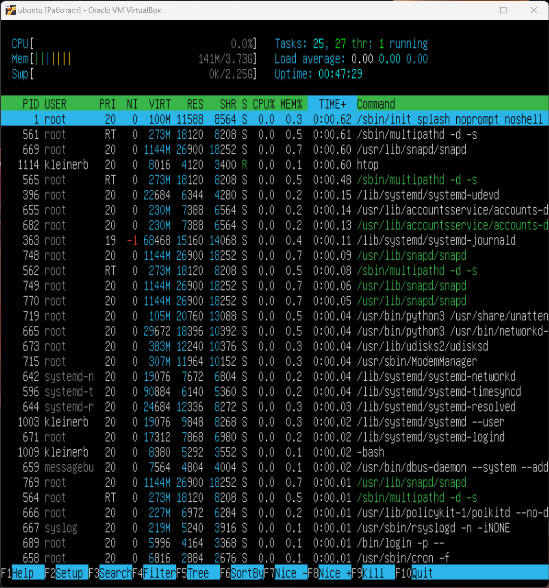

# Report

### Part 1
#### Устоановка ОС

### Part 2
#### 1. Создание нового пользователя командой sudo adduser и добавление в группу adm 

#### 2. Вывод cat /etc/passwd

### Part 3
#### 1. Создание нового хоста

#### 2. Установка временной зоны

#### 3. Вывод названия сетевых интерфейсов ip a

#### lo - интерфейс, используемый для отладки сетевых прогамм и запуска серверных приложений на локальной машине. Дополнительное средство в устранении проблем физического соединения.
#### Используя консольную команду получить ip адрес устройства, на котором вы работаете, от DHCP сервера. Получение IP адреса устройства от DHCP сервера командой hostname -I

#### 4. DCHP - протокол прикладного уровня, позволяющий сетевым устройствам автоматически получать IP адрес и другие параметры, необходимые для работы в сети TCP/IP. Архитектура "клиент - сервер". При использовании DCHP, весь процесс автоматизирован, управляется централизованно. DCHP сервер поддерживает пул IP адресов и арендованый адрес клиенту с поддержкой DCHP при запуске в сети.
#### 5. Определить и вывести на экран внешний ip-адрес шлюза (ip) и внутренний IP-адрес шлюза, он же ip-адрес по умолчанию (gw).

#### 6. Задать статичные (заданные вручную, а не полученные от DHCP сервера) настройки ip, gw, dns (использовать публичный DNS серверы, например 1.1.1.1 или 8.8.8.8).

#### 7. Пингуем

### Part 4. Обновление ОС
#### 1. Обновление ОС до последней версии на момент выполнения задания

### Part 5. Использование команды sudo
#### 1. sudo это суперпользователь или похожее на права администратора (группа root). Разрешить пользователю, созданному в Part 2, выполнять команду sudo.

#### 

### Part 6. Установка и настройка службы времени
#### Настроить службу автоматической синхронизации времени.

### Part 7. Установка и использование текстовых редакторов
#### VIM для выхода и сохранение :wq

#### nano для выхода и сохранение ctrl+x

#### joe ctrl+k - x

#### Используя каждый из трех выбранных редакторов, откройте файл на редактирование, отредактируйте файл, заменив никнейм на строку "21 School 21", закройте файл без сохранения изменений.
#### vim :q!
#### nano ctrl+x - no
#### joy ctrl+k - q - n

#### Используя каждый из трех выбранных редакторов, отредактируйте файл ещё раз (по аналогии с предыдущим пунктом), а затем освойте функции поиска по содержимому файла (слово) и замены слова на любое другое.

#### замена :s /school/SCHOOL

#### поиск и замены в nano ctrl+w & ctrl+r

#### поиск и замена в joe
#### ctrl+k f school r "на что меняем" y

### Part 8. Установка и базовая настройка сервиса SSHD
#### Установить службу SSHd. sudo apt install openssh-server
#### Добавить автостарт службы при загрузке системы. sudo systemctl enable ssh

#### Перенастроить службу SSHd на порт 2022.

#### Используя команду ps, показать наличие процесса sshd. Для этого к команде нужно подобрать ключи.
#### Вывод процесса sshd командой ps -aux | grep ssh

####  'ps' - программа для определения работающих в системе программ и оценки используемых ими ресурсов. Она выводит статистику и информацию о состоянии процессов в системе, в том числе ИД процесса или нити, объем выполняемого ввода-вывода и используемый объем ресурсов процессора и памяти.
#### Ключи: 
#### -A, -e - выбор всех процессов
#### -a - выбор всех процессов, кроме фоновых
#### -d - выбор всех процессов, включая фоновые, кроме процессов сессий
#### -N - выбор всех процессов, кроме указанных
#### -C - выбор процессов по имени команды
#### -G - выбор процессов по ID группы
#### -p - выбор процессов PID
#### --ppid - выбор процессов по PID родительского процесса
#### -s - выбор процессов по ID сессии
#### -t - выбор процессов по tty
#### -u - выбор процессов пользователя
#### -x - найти все вхождения строки поиска
#### -c - отображение информации планировщика
#### -f - вывод максимума доступных данных
#### -F - выводит больше данных
#### -l - длинный формат вывода
#### -j - вывод процессов Jobs
#### -M - добавить информацию о безопасности
#### -o - позволяет определить свой формат вывода
#### --sort - выполняет сортировку указанной колонки
#### -L - отображать потоки процессов в колонках LWP и NLWP
#### -m - вывести потоки после процесса
#### -V - вывести информацию о версии
#### -H - отображать дерево процессов
#### Более подробно можно узнать man ps
#### sudo reboot
#### Вывод команды netstat -tan 

#### Значение ключей -tan:
#### -t - отображение tcp
#### 
#### -a - Отображать все сокеты
#### 
#### -n - отключает определение доменных имён для ip-адресов
#### 
#### Значение каждого столбца вывода:
#### tcp - сетевой протокол
#### 
#### Recv-Q - количество байтов, помещённых в буфер приёма TCP/IP, но не переданных приложению.
#### 
#### Send-Q - количество байтов, помещённых в буфер отправки TCP/IP, но не отправленных, или отправленных, но не подтверждённых.
#### 
#### local address - адрес по которому можно обратиться к нашей ВМ
#### 
#### foreign address - адрес с которого можно обратиться
#### 
#### state - состояние порта. принимает ли он соединения
#### 
#### 0.0.0.0 - все ip-адреса

### Part 9. Установка и использование утилит top, htop
#### Установить и запустить утилиты top и htop.

#### up 35 min время работы
#### 1 user количество авторизованных юзеров
#### load average 0.00, 0.00, 0.00 загрузка системы
#### tasks 93 total общее количество процессов
#### %Cpu загрузка ЦП
#### MiB Mem загрузка памяти
#### PID процесса который занимает больше всего процессорного времени и памяти - 120
#### htop
#### скрин с выводом команды htop: отсортированному по PID, PERCENT_CPU, PERCENT_MEM, TIME
#### PID

#### PERCENT_CPU

#### PERCENT_MEM

#### TIME

#### фильтр sshd

#### поиск syslog - найдено 5

#### с добавленным выводом hostname, clock и uptime

### Part 10. Использование утилиты fdisk

#### Название - sda. Размер 25Gib. 52428800 секторов
#### sudo swapon --show

### Part 11. Использование утилиты df
#### df

#### DF - kbyte - размер в килобайтах - размер раздела - 11758760 размер занятого пространства - 5066768 размер свободного пространства - 6072884 процент использования - 46% 
#### df -Th -размер раздела - 12G размер занятого пространства- 4.9G размер свободного пространства - 5.8G процент использования - 46%

### Part 12. Использование утилиты du
#### sudo du -hsb /home

#### sudo du -hsb /var

#### sudo du -hsb /var/log

#### sudo du -hsb /var/log*

### Part 13. Установка и использование утилиты ncdu
#### sudo apt install ncdu
#### sudo ncdu /home

#### sudo ncdu /var

#### sudo ncdu /var/log

### Part 14. Работа с системными журналами
#### 1. /var/log/dmesg

#### 2. /var/log/syslog

#### 3. /var/log/auth.log

#### Время атворизации 22.09.23 22:42:29 kleinerb метод-LOGIN

### Part 15. Использование планировщика заданий CRON
#### открыть планировщик crontabe -e

#### выполнение заданий из планировщика

#### удаление планировщика crontab -e и удаление последней строки */2 * * * * uptime.
