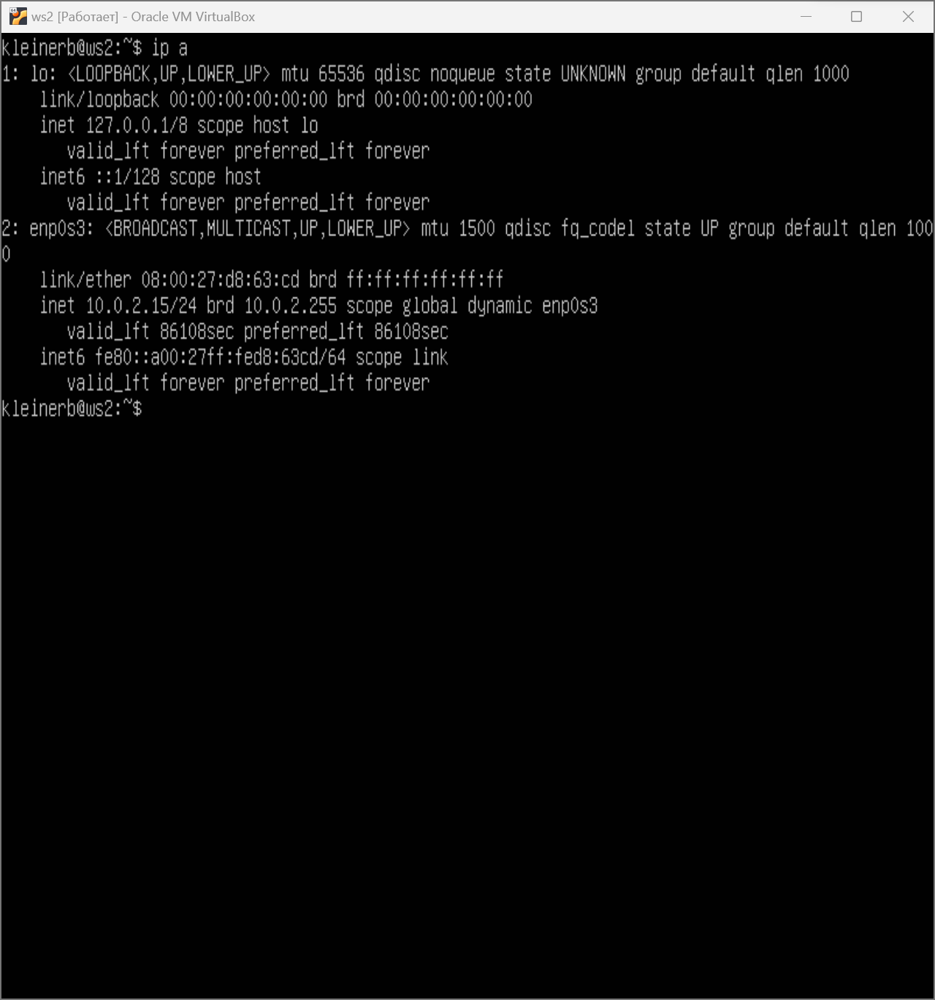
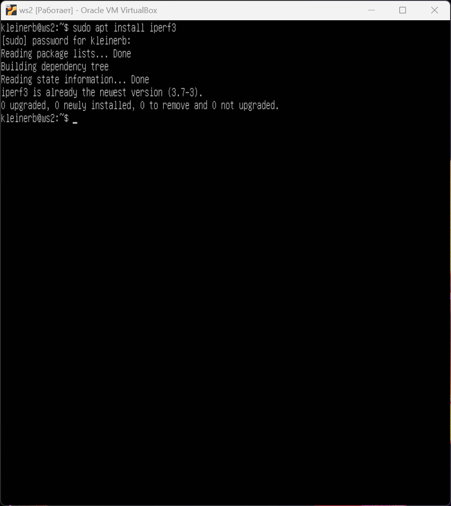
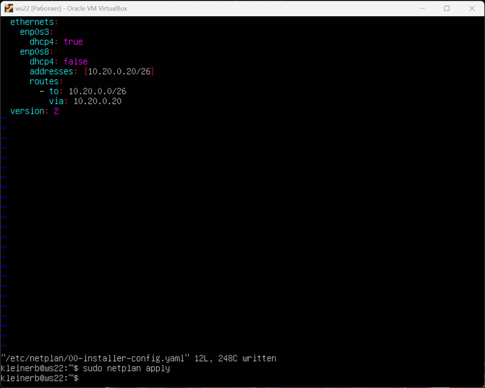
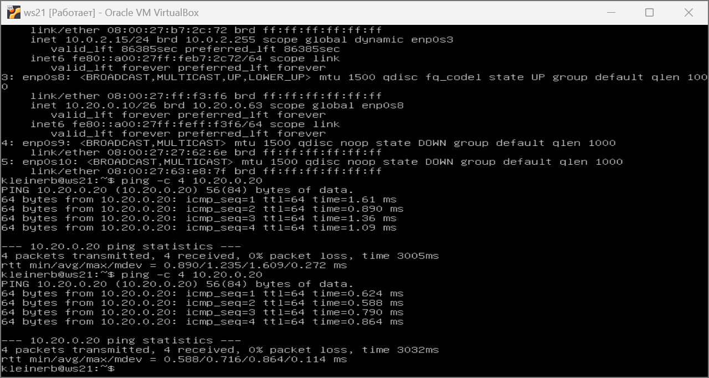
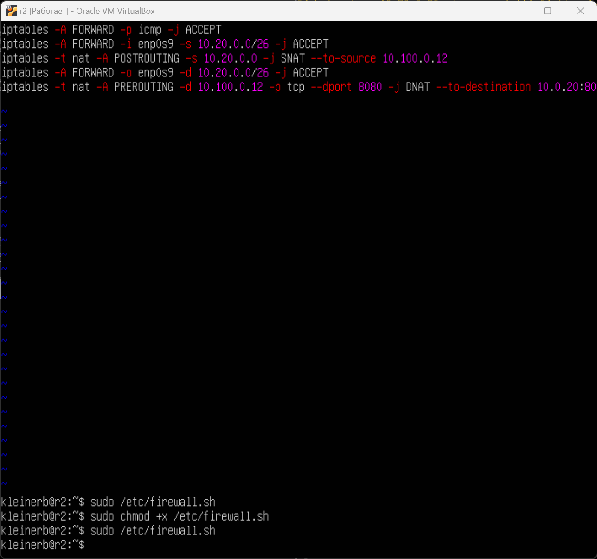
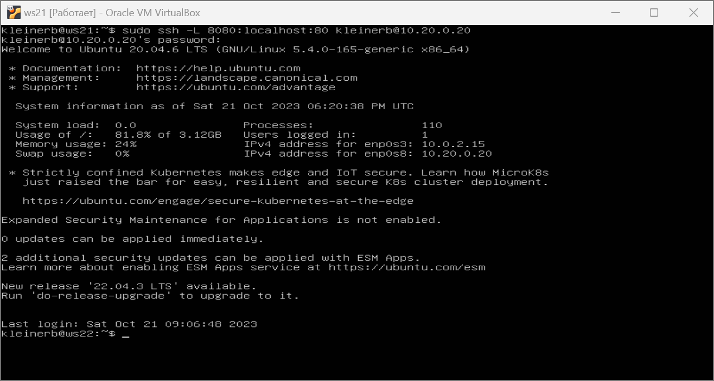

## Сети в Linux

## Part 1. Инструмент ipcalc
#### 1.1. Сети и маски
- установка ipcalc

##### Определить и записать в отчёт:
##### 1) адрес сети 192.167.38.54/13
- адрес сети 192.160.0.0/13 или 192.160.0.0

##### 2) перевод маски 255.255.255.0 в префиксную и двоичную запись, /15 в обычную и двоичную, 11111111.11111111.11111111.11110000 в обычную и префиксную
- 255.255.255.0(обычная запись) = /24(префиксная запись) = 11111111.11111111.11111111.00000000 (двоичная запись)

- /15(префиксная запись) = 255.254.0.0(обычная запись) = = 11111111.11111110.00000000.00000000 (двоичная запись)

- 11111111.11111111.11111111.11110000 (двоичная запись) = 255.255.255.240(обычная запись) = /28(префиксная запись)

##### 3) минимальный и максимальный хост в сети 12.167.38.4 при масках: /8, 11111111.11111111.00000000.00000000, 255.255.254.0 и /4
- /8
- hostmin 12.0.0.1
- hostmax 12.255.255.254

- 11111111.11111111.00000000.00000000 (то есть /16)
- hostmin 12.167.0.1
- hostmax 12.167.255.254

- 255.255.254.0 (то есть /23)
- hostmin 12.167.38.1
- hostmax 12.167.39.254

- /4
- hostmin 0.0.0.1
- hostmax 15.255.255.254

#### 1.2. localhost

Определить и записать в отчёт, можно ли обратиться к приложению, работающему на localhost, со следующими IP: 194.34.23.100, 127.0.0.2, 127.1.0.1, 128.0.0.1

##### localhost (так называемый, «местный» от англ. local, или «локальный хост», по смыслу — этот компьютер) — в компьютерных сетях, стандартное, официально зарезервированное доменное имя для частных IP-адресов (в диапазоне 127.0.0.1 — 127.255.255.254, RFC 2606).

- 192.34.23.100 нельзя
- 127.0.0.2 можно
- 127.1.0.1 можно
- 128.0.0.1 нельзя

#### 1.3. Диапазоны и сегменты сетей

Определить и записать в отчёт:

#### 1) какие из перечисленных IP можно использовать в качестве публичного, а какие только в качестве частных: 10.0.0.45, 134.43.0.2, 192.168.4.2, 172.20.250.4, 172.0.2.1, 192.172.0.1, 172.68.0.2, 172.16.255.255, 10.10.10.10, 192.169.168.1
- 10.0.0.45 - Class A - private
- 134.43.0.2 - Class B - Public
- 192.168.4.2 - Class C - Private
- 172.20.250.4 - Class B - Private
- 172.0.2.1 - Class B - Public
- 192.172.0.1 - Class C - Public
- 172.68.0.2 - Class B - Public
- 172.16.255.255 - Class B - Private
- 10.10.10.10 - Class A - private
- 192.169.168.1 - Class C - Public

#### 2) какие из перечисленных IP адресов шлюза возможны у сети 10.10.0.0/18: 10.0.0.1, 10.10.0.2, 10.10.10.10, 10.10.100.1, 10.10.1.255
- для сети 10.10.0.0/18 диапазон IP адресов шлюза
- HostMin 10.10.0.1  
- HostMax 10.10.63.254 

## Part 2. Статическая маршрутизация между двумя машинами

##### Поднять две виртуальные машины (далее -- ws1 и ws2)

##### С помощью команды ip a посмотреть существующие сетевые интерфейсы

- ws1

- ws2 

##### Описать сетевой интерфейс, соответствующий внутренней сети, на обеих машинах и задать следующие адреса и маски: ws1 - 192.168.100.10, маска /16, ws2 - 172.24.116.8, маска /12
- ws1

- ws2

##### 2.1. Добавление статического маршрута вручную

Добавить статический маршрут от одной машины до другой и обратно при помощи команды вида ip r add

##### 2.2. Добавление статического маршрута с сохранением
##### reboot
##### Добавить статический маршрут от одной машины до другой с помощью файла etc/netplan/00-installer-config.yaml

- ping ws1 - ws2

- ping ws2 - ws1

## Part 3. Утилита iperf3

##### 3.1. Скорость соединения
Перевести и записать в отчёт: 
- 8 Mbps в MB/s = 1 MB/s
- 100 MB/s в Kbps = 800000 Kbps
- 1 Gbps в Mbps =1000 Mbps

##### 3.2. Утилита iperf3
установка iperf3

Измерить скорость соединения между ws1 и ws2
На ws1 iperf3 -s запускаем режим сервера

На ws2 iperf3 -c и ip 192.168.100.10 Выполняем роль клиента и измеряем скорость соединения.

## Part 4. Сетевой экран

#### 4.1. Утилита iptables
##### Создать файл */etc/firewall.sh*, имитирующий фаерволл, на ws1 и ws2, применив подряд следующие правила:

1) на ws1 применить стратегию когда в начале пишется запрещающее правило, а в конце пишется разрешающее правило (это касается пунктов 4 и 5)

2) на ws2 применить стратегию когда в начале пишется разрешающее правило, а в конце пишется запрещающее правило (это касается пунктов 4 и 5)

3) открыть на машинах доступ для порта 22 (ssh) и порта 80 (http)

4) запретить echo reply (машина не должна "пинговаться”, т.е. должна быть блокировка на OUTPUT)

5) разрешить echo reply (машина должна "пинговаться")

файл /etc/firewall на ws1 

файл /etc/firewall на ws2

Запустить файлы на обеих машинах командами chmod +x /etc/firewall.sh и /etc/firewall.sh
##### ws1

##### ws2

##### iptabels выполняет правила сверху вниз по порядку, то машины ws1 в первую очередь выполнит команду REJECT - отклонить пакет из-за чего пинг не случится. В случае машины ws2 пинг случится, т.к. первым стоит ACCEPT - разрешить прохождение пакета

#### 4.2. Утилита nmap
##### Командой ping найти машину, которая не "пингуется", после чего утилитой nmap показать, что хост машины запущен

- пингуем ws1 с ws2 - пингуются

- пингуем ws2 с ws1 -не пингуются

##### утилитой nmap показать, что хост машины запущен

##### Сохранить дампы образов виртуальных машин

## Part 5. Статическая маршрутизация сети
##### Поднять пять виртуальных машин (3 рабочие станции (ws11, ws21, ws22) и 2 роутера (r1, r2))

##### Настроить конфигурации машин в etc/netplan/00-installer-config.yaml согласно сети на рисунке.

##### настройки ws11

##### настойки r1

##### настройки r2

##### настройки ws21

##### настройки ws22

##### ip - 4 a
##### ws22 

##### ws21 

##### ws11

##### r1

##### r2

###### пропинговать ws22 с ws21. Аналогично пропинговать r1 с ws11.

#### 5.2. Включение переадресации IP-адресов.
##### Для включения переадресации IP, выполните команду на роутерах:
##### sysctl -w net.ipv4.ip_forward=1 При таком подходе переадресация не будет работать после перезагрузки системы.
r1

r2

##### Откройте файл /etc/sysctl.conf и добавьте в него следующую строку:
net.ipv4.ip_forward = 1
При использовании этого подхода, IP-переадресация включена на постоянной основе.
r1

r2

#### 5.3. Установка маршрута по-умолчанию 

##### Настроить маршрут по-умолчанию (шлюз) для рабочих станций. Для этого добавить `default` перед IP роутера в файле конфигураций
- ws11

- ws21

- ws22

##### ip r
- ws11

- ws21

- ws22

#### 5.4. Добавление статических маршрутов
##### Добавить в роутеры r1 и r2 статические маршруты в файле конфигураций
- r1

- r2

##### Вызвать ip r и показать таблицы с маршрутами на обоих роутерах. Пример таблицы на r1:
##### ip r
- r1 

- r2

##### Вызвать ip r и показать таблицы с маршрутами на обоих роутерах. Пример таблицы на r1: ip r list 10.10.0.0/[маска сети] и ip r list 0.0.0.0/0 на ws11

##### Ответ - Почему для адреса 10.10.0.0/[маска сети] был выбран маршрут, отличный от 0.0.0.0/0, хотя он попадает под маршрут по-умолчанию?Этот маршрут приоритетнее в связи с тем, что роутер самым приоритетным считает маршрут с наиболее длинной маской, а маршрут с маской 0 самый последний в приоритете.

#### 5.5. Построение списка маршрутизаторов

##### Запускаем на r1 tcpdump -tnv -i eth0, вместо eth0 ставим интерфейс (смотрим через tcpdump -D) берём enp0s3; Далее на ws11 пингуем, чтобы была отправка пакетов.

##### При помощи утилиты traceroute построить список маршрутизаторов на пути от ws11 до ws21

###### Каждый пакет проходит на своем пути определенное количество узлов, пока достигнет своей цели. Причем, каждый пакет имеет свое время жизни. Это количество узлов, которые может пройти пакет перед тем, как он будет уничтожен. Этот параметр записывается в заголовке TTL, каждый маршрутизатор, через который будет проходить пакет уменьшает его на единицу. При TTL=0 пакет уничтожается, а отправителю отсылается сообщение Time Exceeded. Команда traceroute linux использует UDP пакеты. Она отправляет пакет с TTL=1 и смотрит адрес ответившего узла, дальше TTL=2, TTL=3 и так пока не достигнет цели. Каждый раз отправляется по три пакета и для каждого из них измеряется время прохождения. Пакет отправляется на случайный порт, который, скорее всего, не занят. Когда утилита traceroute получает сообщение от целевого узла о том, что порт недоступен трассировка считается завершенной.

#### 5.6. Использование протокола ICMP при маршрутизации

##### Запустить на r1 перехват сетевого трафика, проходящего через eth0 с помощью команды:
- tcpdump -n -i eth0 icmp

##### Пропинговать с ws11 несуществующий IP (например, 10.30.0.111) с помощью команды:
- ping -c 1 10.30.0.111

## Part 6. Динамическая настройка IP с помощью DHCP
###### Для r2 настроить в файле /etc/dhcp/dhcpd.conf конфигурацию службы DHCP:

###### в файле resolv.conf прописать nameserver 8.8.8.8.

###### Перезагрузить службу DHCP командой systemctl restart isc-dhcp-server

###### Машину ws21 перезагрузить при помощи reboot и через ip a показать, что она получила адрес. Также пропинговать ws22 с ws21.

###### Указать MAC адрес у ws11, для этого в etc/netplan/00-installer-config.yaml надо добавить строки: macaddress: 10:10:10:10:10:BA, dhcp4: true

###### Для r1 настроить аналогично r2, но сделать выдачу адресов с жесткой привязкой к MAC-адресу (ws11). Провести аналогичные тесты

###### перезагрузка 

###### пингуем ws22 с ws11

###### ip a

subnet – сеть, в которой будут работать настройки;
option routers – шлюз по-умолчанию;
range – диапазон IP-адресов;
option domain-name-servers – DNS-сервера;

## Part 7. NAT
###### В файле /etc/apache2/ports.conf на ws22 и r1 изменить строку Listen 80 на Listen 0.0.0.0:80, то есть сделать сервер Apache2 общедоступным
- ws22

- r1

###### Запустить веб-сервер Apache командой service apache2 start на ws22 и r1

- ws22

- r1

###### Добавить в фаервол, созданный по аналогии с фаерволом из Части 4, на r2 следующие правила:

- 1) удаление правил в таблице filter - iptables -F

- 2) удаление правил в таблице "NAT" - iptables -F -t nat

- 3) отбрасывать все маршрутизируемые пакеты - iptables --policy FORWARD DROP

###### Проверить соединение между ws22 и r1 командой ping

###### Добавить в файл ещё одно правило:

- 4) разрешить маршрутизацию всех пакетов протокола ICMP

###### Запускать файл также, как в Части 4

- 5) включить SNAT, а именно маскирование всех локальных ip из локальной сети, находящейся за r2 (по обозначениям из Части 5 - сеть 10.20.0.0)

- Совет: стоит подумать о маршрутизации внутренних пакетов, а также внешних пакетов с установленным соединением

- 6) включить DNAT на 8080 порт машины r2 и добавить к веб-серверу Apache, запущенному на ws22, доступ извне сети
Совет: стоит учесть, что при попытке подключения возникнет новое tcp-соединение, предназначенное ws22 и 80 порту

###### Проверить соединение по TCP для SNAT, для этого с ws22 подключиться к серверу Apache на r1 командой: telnet [адрес] [порт]

## Part 8. Дополнительно. Знакомство с SSH Tunnels
###### Запустить на r2 фаервол с правилами из Части 7

###### Запустить веб-сервер Apache на ws22 только на localhost (то есть в файле /etc/apache2/ports.conf изменить строку Listen 80 на Listen localhost:80)

###### Воспользоваться Local TCP forwarding с ws21 до ws22, чтобы получить доступ к веб-серверу на ws22 с ws21
- ssh -L 8080:localhost:80 ws22@10.20.0.20

###### Воспользоваться Remote TCP forwarding c ws11 до ws22, чтобы получить доступ к веб-серверу на ws22 с ws11

###### Для проверки, сработало ли подключение в обоих предыдущих пунктах, перейдите во второй терминал (например, клавишами Alt + F2) и выполните команду:
telnet 127.0.0.1 [локальный порт]

