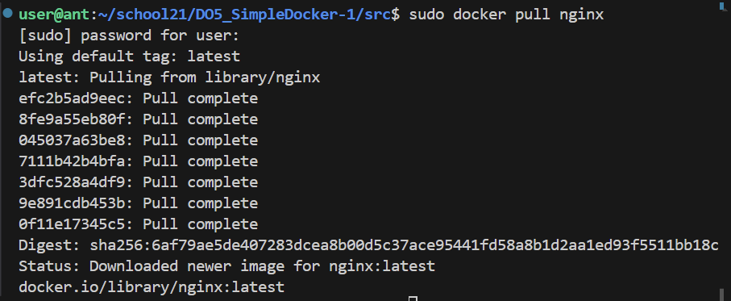
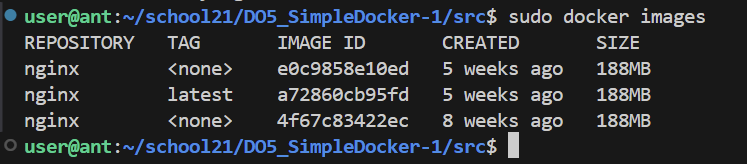
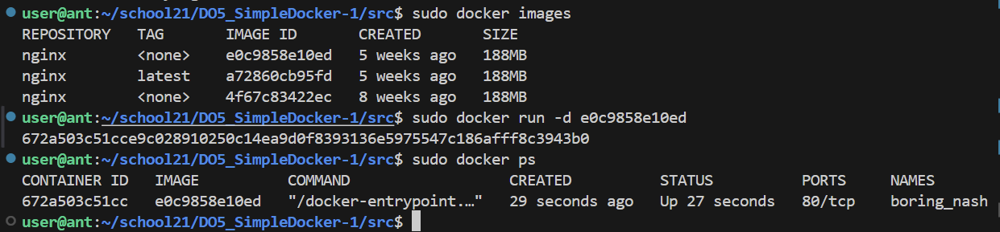
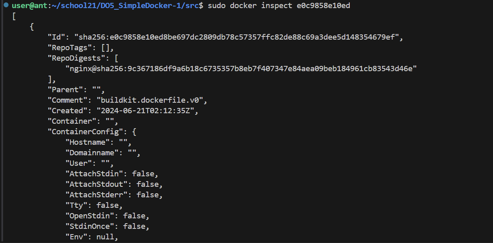
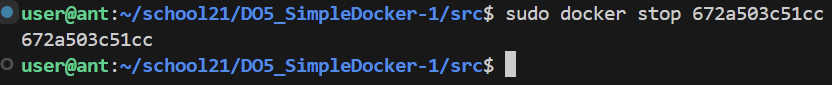
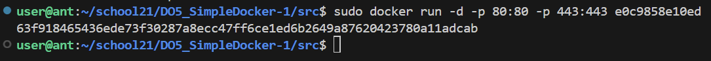
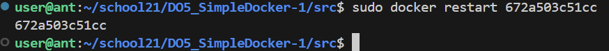
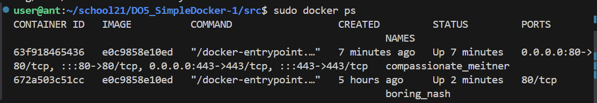
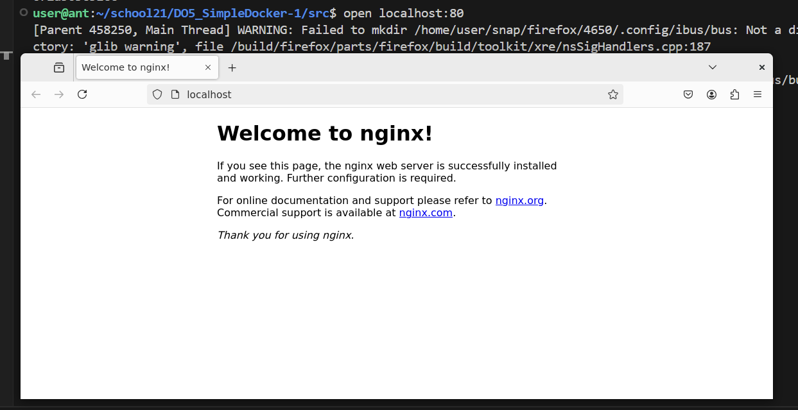
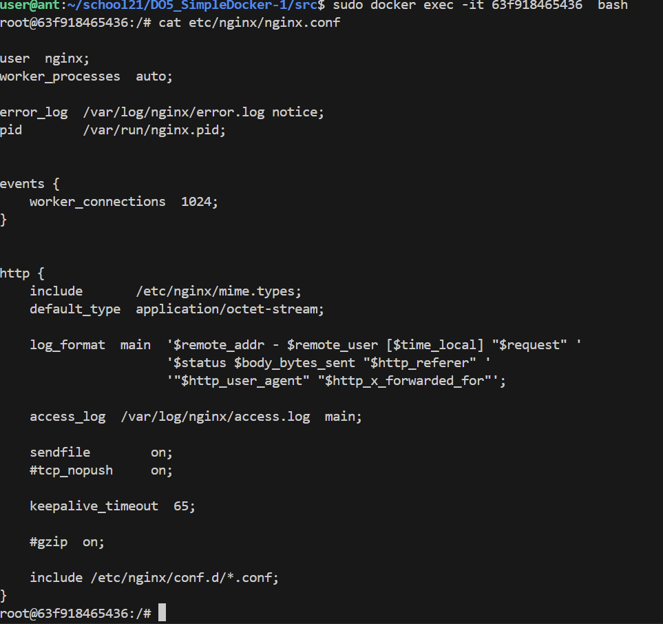

# Simple Docker

## Part 1. Готовый докер

### В качестве конечной цели своей небольшой практики ты сразу выбрал написание докер-образа для собственного веб-сервера, а потому в начале тебе нужно разобраться с уже готовым докер-образом для сервера. Твой выбор пал на довольно простой nginx.

#### Возьми официальный докер-образ с nginx и выкачай его при помощи docker pull.

##### Проверь наличие докер-образа через docker images.

##### Запусти докер-образ через docker run -d [image_id|repository].
##### Проверь, что образ запустился через docker ps.

##### Посмотри информацию о контейнере через docker inspect [container_id|container_name].

##### По выводу команды определи и помести в отчёт размер контейнера, список замапленных портов и ip контейнера.

- "Size": 187669514 байт или 178,98 мегабайт
- замапленные порты 80/tcp
- Контейнер использует внутренний IP-адрес 172.17.0.2

##### Останови докер образ через docker stop [container_id|container_name].
- sudo docker stop 672a503c51cc

##### Проверь, что образ остановился через docker ps.

##### Запусти докер с портами 80 и 443 в контейнере, замапленными на такие же порты на локальной машине, через команду run.

##### Проверь, что в браузере по адресу localhost:80 доступна стартовая страница nginx.

##### Перезапусти докер контейнер через docker restart [container_id|container_name].

## Part 2. Операции с контейнером

##### Прочитать конфигурационный файл *nginx.conf* внутри докер образа через команду *exec*

- Интерактивный режим:

`sudo docker exec -it 63f918465436  bash`

`cat etc/nginx/nginx.conf`

`exit`

- Другой вариант

`sudo docker exec compassionate_meitner cat etc/nginx/nginx.conf`